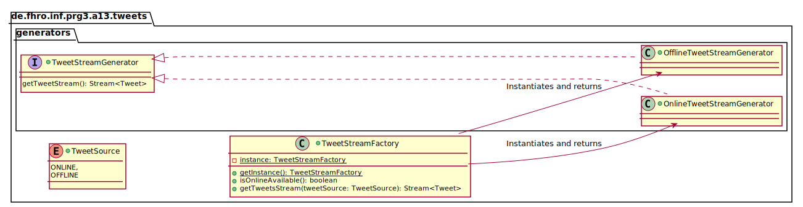
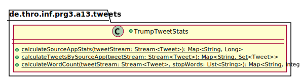
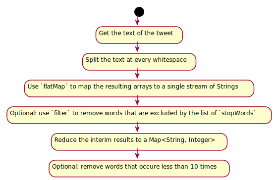

_This is an assignment to the class [Programmieren 3](https://hsro-inf-prg3.github.io) at the [University of Applied Sciences Rosenheim](http://www.fh-rosenheim.de)._

# Assignment 13: Map-Reduce and Collect

This assignment covers some more advanced concepts of the Java 8 `Stream`s API.
The concepts that are specifically topic of this assignment are:

* _Map-Reduce_
* _Collecting_
* _Grouping-By_

We'll use _Map-Reduce_ to implement the classical _word count_ example.
As sample data the repository contains about 3.000 tweets of Donald Trump we will analyze in this assignment.
As an alternative the assignment also contains a generator which uses the Twitter API to fetch the tweets live.
To be able to use this generator you have to do some [additional configuration](#using-the-twitter-api).

A clever data scientist discovered that most of the angrier tweets came from Android where the nicer ones were written with an iPhone ([first article](http://varianceexplained.org/r/trump-tweets/) and [follow up article](http://varianceexplained.org/r/trump-followup/)).
We will have a look if we can use Java's `Stream`s to group the tweets by the kind of client which was used to create them.

## Setup

1. Create a fork of this repository (button in the right upper corner)
1. Clone the project (get the link by clicking the green _Clone or download button_)
1. Import the project to your **IntelliJ**
1. **Read the whole assignment spec!**

_Remark: the given test suite is incomplete and **won't** succeed after the checkout!_

## Generators

To be able to analyze the tweets we need a generator which loads the given tweets (from a JSON file) and exposes them as a `Stream`.

The following UML shows the class structure of the generators and the factory which exposes them.



_Remark: the UML is not complete but just meant as implementation hint and for orientation._

_Hint: the dependency to GSON is already added and GSON exposes the following method:_

```java
Gson gson = new Gson();
Tweet[] tweets = gson.fromJson(reader, Tweet[].class);
```

Where `reader` is an instance of the abstract class `Reader`.
To access files from the `resources` folder implement something like in this snippet:

```java
getClass().getResourceAsStream("/path/to/trump_tweets.json");
```

_Side note: this is only possible if you are in a non `static` context, otherwise you have to write something like this: `MyClass.class.getResourceAsStream(...)`._

To implement the `OfflineTweetStreamGenerator` follow these steps:

1. Create the class `OfflineTweetStreamGenerator`.
1. Implement the interface `TweetStreamGenerator`.
1. Implement the method `getTweetStream` by using GSON and the helper method `Arrays.stream(T[] array)` to load the JSON file and create a new `Stream` from the deserialized tweet array.

Those who want to play around with some additional language features could use `try-with-resources` for the deserialization of the tweets.

And those who want a more functional way may be interested in this [Gist](https://gist.github.com/baez90/659d121064ff102a4e1e6a31bcf639c4).

## Collecting

Until now `Stream`s are nice to have but printing all results to the command line with the terminator `forEach(...)` is not really practicable.

To be able to process the data we need to `collect` them e.g. in a `List<>` or a `Set<>` or any other _Collection_.

Fortunately the `Stream`s API already defines a method `.collect(...)` and the JDK contains the utility class `Collectors` which defines the most common collectors.

With the `OfflineTweetStreamGenerator` working  we can start to analyze the tweets in the class `TrumpTweetStats`.
The following UML contains the signatures of the methods to be implemented in this assignment.



Don't worry, the method stubs are given already!
The UML is only meant to keep the signatures in mind while you're reading the spec.

The first two tasks are the implementation of the methods:

* `calculateSourceAppStats`
* `calculateTweetsBySourceApp`

### `calculateSourceAppStats`

This method groups the tweets by the app they were created with and counts how many tweets were created with which app.
In SQL you would write it like this:

```sql
SELECT source, count(*) FROM tweets
GROUP BY source
```

If you want to try it on your own: the repository contains a SQL script that creates a `tweet` table and insert all the tweets to it.
The script has been tested on MSSQL and PostgreSQL but if you want to use it on MySQL or MariaDB some additional work might be necessary.

Every `Tweet` instance has two methods to access the `source`:

* `getSource()`
* `getSourceApp()`

The first one returns a string like this: `<a href="http://twitter.com/download/iphone" rel="nofollow">Twitter for iPhone</a>`.
The second one extracts the actual name of the app `Twitter for iPhone`.
It does not matter for the assignment which one you choose but the second one is a little bit prettier when the result is printed.

_Side note: the task is thought to be solved with `collect` but it's also possible to do it with `reduce`!_

### `calculateTweetsBySourceApp`

This method is very similar to `calculateSourceAppStats` but instead of just counting the tweets it collects them as a `Set<Tweet>` for further analysis.

Where the method `calculateSourceAppStats` was very easy to implement with SQL, this method is impossible to implement in SQL because SQL does not define a map of lists (i.e. a tuple of tuples)!

_Side note: the task is thought to be solved with `collect` but it's also possible to do it with `reduce`!_

## Map-Reduce

A classical algorithm used to process huge amounts of data is _Map-Reduce_.
As the name already indicates the algorithm consists of two steps:

* _Map_ - transform the data in parallel
* _Reduce_ - retrieve all interim results and aggregate them

If you're looking for examples of _Map-Reduce_, the first hit will most likely be the word count problem.
It's relatively simple to implement as there's not much transformation required and it demonstrates the concept very well.

We want to analyze which words are the most common in the given tweets.
The following flow chart is meant as orientation how to implement the _Map-Reduce_ algorithm.



The text of the tweet can be split like this:

```java
String[] split = "Hello World".split("( )+");
```

The `reduce` method requires a so called accumulator.
For this method, an instance of `HashMap<>` or `LinkedHashMap<>` seams to be a good idea.
The next part is the reduction step and should be an instance of `BiFunction<>`.
It's a function where the accumulator and a single value is passed in and the accumulator is returned after the value is processed (e.g. inserted to a list).
The last part is a combiner.
It's meant to combine two accumulator values but you won't need it this time.

_Debugging hint: the latest IntelliJ Idea ships with the plugin [Java Stream Debugger](https://plugins.jetbrains.com/plugin/9696-java-stream-debugger). The plugin visualizes how the stream is transformed step by step (including the actual data). That's very helpful if something is happening you don't expect to happen!_

_Another hint: the given 3225 tweets are a little bit too much to debug your `Stream` if something is going wrong. It may help to `limit` the `Stream` you're passing to the method `calculateWordCount` to e.g. 200 elements!_

_Last but not least: the Map-Reduce algorithm is a little bit tricky when you implement it for the first time. If you're stuck, Google can help you!_

There are already some unit tests but it might be a good idea to extend the test suite.

## Using the Twitter API

To be able to use Twitter4j you're required to configure it by setting OAuth consumer key, consumer secret, access token and access token secret in a file called `twitter4j.properties` that is in the root of your `resources` folder (right next to the files `stopwords.txt` and `trump_tweets.json`).
The file should have the following structure:

```properties
debug=true
oauth.consumerKey=<dummy>
oauth.consumerSecret=<dummy>
oauth.accessToken=<dummy>
oauth.accessTokenSecret=<dummy>
```

To get these tokens you need to register a [Twitter app](https://apps.twitter.com).
Then you have to fill in some basic information about the "app" you're creating.

After the registration of your new app you'll be able to retrieve the required information.
Copy the given structure to a new file `twitter4j.properties` and replace the `<dummy>` strings with your actual keys and secrets and you should be able to fetch the tweets live from the API.